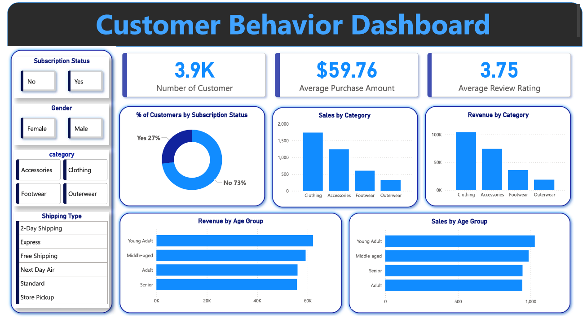

# 🛍️ Customer Shopping Behavior Analysis

## 📖 Project Overview

This project analyzes customer shopping behavior for a retail company to uncover insights that can improve **sales, customer engagement, and long-term loyalty**.

The analysis focuses on identifying patterns across:

* Customer demographics
* Product categories
* Discounts and promotions
* Purchase frequency and behavior

---

## 🎯 Business Problem

A retail company wants to better understand how customers shop and what factors influence their purchasing decisions.

**Key Question:**

> How can the company leverage consumer shopping data to identify trends, improve customer engagement, and optimize marketing and product strategies?

---

## 🛠️ Tools & Technologies

* **Python (Pandas)** → Data cleaning & transformation
* **SQL (MySQL)** → Data analysis & querying
* **Power BI** → Dashboard & visualization

---

## 📂 Dataset

The dataset contains **3,900 customer records** with features such as:

* Age, Gender
* Product purchased & category
* Purchase amount
* Discount usage
* Review ratings
* Purchase frequency
* Subscription status

---

## 🔧 Data Preparation (Python)

Key steps performed:

* Handled missing values (e.g., filled `review_rating` using median by category)
* Standardized column names (lowercase, underscores)
* Created new features:

  * `age_group` (customer segmentation)
  * `purchase_frequency_days` (converted categorical frequency into numeric)
* Cleaned and structured dataset for SQL analysis

---

## 🧠 SQL Analysis & Key Insights

### 1. Revenue by Gender

* Compared total revenue generated by male vs female customers

### 2. High-Spending Discount Users

* Identified customers who used discounts but still spent above average

### 3. Top Rated Products

* Found top 5 products with highest average review ratings

### 4. Subscription Impact

* Compared subscribers vs non-subscribers:

  * Average spend
  * Total revenue

### 5. Discount Behavior Analysis

* Analyzed how discounts impact purchasing patterns

### 6. Customer Segmentation

Customers were grouped into:

* **New** (≤ 2 purchases)
* **Returning** (3–10 purchases)
* **Loyal** (> 10 purchases)

### 7. Top Products by Category. --- and more

* Identified top 3 most purchased products within each category using window functions

---

## 📊 Dashboard (Power BI)

An interactive dashboard was created to visualize:

* Sales trends
* Customer segmentation
* Product performance
* Discount impact



---

## 💡 Key Insights

* Discounts significantly influence purchasing decisions
* Loyal customers contribute a major portion of revenue
* Certain product categories consistently outperform others
* Subscription status impacts overall spending behavior

---

## 📈 Business Recommendations

* Target loyal customers with exclusive offers
* Optimize discount strategies to maximize revenue
* Focus marketing on high-performing categories
* Improve low-rated products based on customer feedback

---

## 📁 Repository Structure

```
├── data/
│   └── customer_shopping_behavior.csv
├── python/
│   └── data_cleaning.ipynb
├── sql/
│   └── analysis_queries.sql
├── dashboard/
│   └── powerbi_dashboard.pbix
│   └── powerbi_dashboard Analysis.pdf
├── presentation/
│   └── project_presentation.pptx
└── README.md
```

---

## 🚀 Conclusion

This project demonstrates how data analytics can be used to:

* Understand customer behavior
* Drive business decisions
* Improve marketing strategies

---

## 👤 Author

**Anshumaan Tripathi**
Aspiring Data Analyst

[Linkedin](https://www.linkedin.com/in/anshumaantripathi)